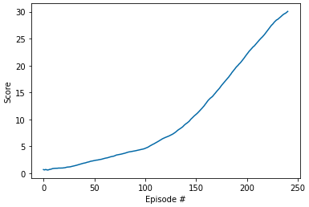

# Navigation Project Report

## Learning Algorithm

The final DDPG agent had two networks: a Q-value network and a policy network to approximate the argmax operation. The architecture of the Q network was
```python
self.fc1 = nn.Linear(in_features=state_size, out_features=100)
self.fc2 = nn.Linear(in_features=100 + action_size, out_features=100)
self.fc3 = nn.Linear(in_features=100, out_features=1)
```
and note that the actions are brought in at the second layer of the network to match the DDPG paper. All layers used ReLu activations except the output layer, which used a linear activation.

The architecture of the final policy network was
```python
self.fc1 = nn.Linear(in_features=state_size, out_features=100)
self.fc2 = nn.Linear(in_features=100, out_features=100)
self.fc3 = nn.Linear(in_features=100, out_features=action_size)
```
and all activations were ReLu except for the output layer, which used tanh to get actions in the correct domain. I added decaying normal noise to the policy throughout training to encourage exploration.

The model was trained with an Adam optimizer on a cpu with hyperparameters

```python
BUFFER_SIZE = int(1e5)  # replay buffer size
BATCH_SIZE = 64  # minibatch size
GAMMA = 0.99  # discount factor
TAU = 1e-3  # for soft update of target parameters
LR = 5e-4  # learning rate
UPDATE_EVERY = 10  # How often to learn
START_NOISE_SCALE = 0.2  # Starting normal std
NOISE_DECAY = 0.999  # How much to decay the noise every time step
```

## Rewards plot

The agent completed the task with only 524 141 as seen in the following plot



The plot illustrates that the agent's learning was slow initially before rapidly improving after around 100 episodes.

## Future directions

There are two major directions that I would take this project to improve performance given more time:

* More arms -- I struggled for a long time trying to get my model to work with the single arm environment and could never make any progress. I was able to solve the project immediately with my existing code as soon as I used an A2C approach and switched over to collecting experience from the 20 arm environment. I wonder if it would be possible to do even better with more arms or what the tradeoff between collecting more uncorrelated experiences and computation is.
* Ornstein-Uhlenbeck noise -- The original DDPG paper proposes using a special type of noise to encourage exploration with physical-inspired tasks like this one. However, I found that I was able to solve the project just using normal noise. I imagine it might be possible to solve the task faster with a more problem-adapted form of noise to encourage appropriate exploration.
